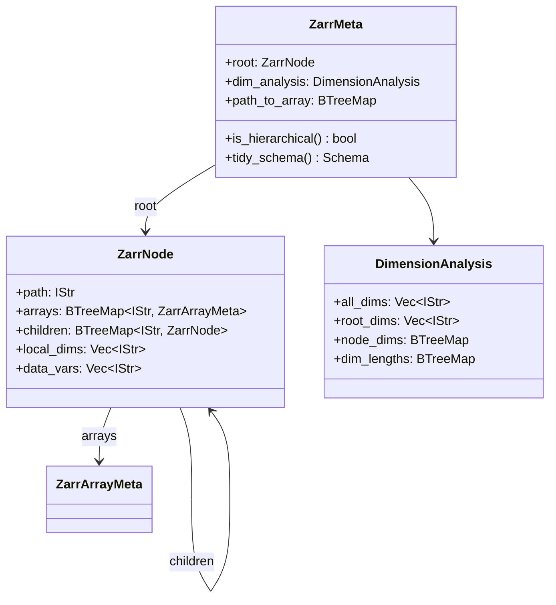

# DataTree Support - Complete Implementation Plan

This plan implements DataTree support using a unified `ZarrMeta` type that handles both flat datasets and hierarchical trees, with detailed broadcasting logic and expression compilation for struct fields.

## Unified Metadata Design



### Key Insight: Flat = Tree with No Children

A flat dataset is simply a tree where `root.children` is empty. This unifies all handling.

---

## Heterogeneous Dimension Strategy

### Rule 1: Extra Dimensions Flatten

When a child group has **additional** dimensions beyond the shared root:

- The output DataFrame expands to include ALL dimensions
- Root variables broadcast/repeat across the extra dimensions
- Child variables populate their natural positions

**Example**: Root has (y, x), atmosphere_3d has (z, y, x)

| z | y | x | surface | atmosphere_3d.temperature |

|---|---|---|---------|---------------------------|

| 0 | 0 | 0 | 1.5     | 273.15                    |

| 0 | 0 | 1 | 2.1     | 274.20                    |

| 1 | 0 | 0 | 1.5     | 270.00 (different z)      |

| 1 | 0 | 1 | 2.1     | 271.50                    |

The `surface` value repeats for each z because surface only varies with (y, x).

### Rule 2: Disjoint Dimensions Null-Fill

When a child group has **completely different** dimensions:

- Add the child's unique dimensions to the output columns
- For rows where the child's data exists, populate the struct
- For other rows, the struct is null

**Example**: timeseries_1d has (station_id) with no shared dims

| z | y | x | station_id | surface_2d | timeseries_1d          |

|---|---|---|------------|------------|------------------------|

| 0 | 0 | 0 | null       | {...}      | null                   |

| 0 | 0 | 1 | null       | {...}      | null                   |

| null | null | null | 0 | null       | {measurement: 1.23}    |

| null | null | null | 1 | null       | {measurement: 2.34}    |

---

## Type Definitions

### Core Types in [`src/meta/types.rs`](src/meta/types.rs)

```rust
/// Unified metadata for any zarr store (flat or hierarchical)
#[derive(Debug, Clone)]
pub struct ZarrMeta {
    pub root: ZarrNode,
    pub dim_analysis: DimensionAnalysis,
    pub path_to_array: BTreeMap<IStr, ZarrArrayMeta>,
}

#[derive(Debug, Clone)]
pub struct ZarrNode {
    pub path: IStr,
    pub arrays: BTreeMap<IStr, ZarrArrayMeta>,
    pub children: BTreeMap<IStr, ZarrNode>,
    pub local_dims: Vec<IStr>,
    pub data_vars: Vec<IStr>,
}

#[derive(Debug, Clone)]
pub struct DimensionAnalysis {
    pub all_dims: Vec<IStr>,
    pub root_dims: Vec<IStr>,
    pub node_dims: BTreeMap<IStr, Vec<IStr>>,
    pub dim_lengths: BTreeMap<IStr, u64>,
}

// Backward compatibility
pub type ZarrDatasetMeta = ZarrMeta;
```

### DimensionAnalysis Methods

```rust
impl DimensionAnalysis {
    /// Compute output dimension order: root dims first, then extras by first appearance
    pub fn compute(root: &ZarrNode) -> Self {
        let mut all_dims = Vec::new();
        let mut node_dims = BTreeMap::new();
        let mut dim_lengths = BTreeMap::new();
        
        // Collect root dims first (they define primary order)
        let root_dims = root.local_dims.clone();
        all_dims.extend(root_dims.iter().cloned());
        
        // Recursively collect from all nodes
        fn collect_node(node: &ZarrNode, all: &mut Vec<IStr>, nd: &mut BTreeMap<...>, dl: &mut BTreeMap<...>) {
            nd.insert(node.path.clone(), node.local_dims.clone());
            
            for dim in &node.local_dims {
                if !all.contains(dim) {
                    all.push(dim.clone());
                }
            }
            // Infer dim lengths from array shapes
            for (_, arr) in &node.arrays {
                for (i, dim) in arr.dims.iter().enumerate() {
                    dl.entry(dim.clone()).or_insert(arr.shape[i]);
                }
            }
            
            for (_, child) in &node.children {
                collect_node(child, all, nd, dl);
            }
        }
        
        collect_node(root, &mut all_dims, &mut node_dims, &mut dim_lengths);
        Self { all_dims, root_dims, node_dims, dim_lengths }
    }
    
    /// Map a node's local dims to output dim positions
    /// Returns None for dims the node doesn't have
    pub fn node_dim_positions(&self, node_path: &str) -> Vec<Option<usize>> {
        let node_dims = self.node_dims.get(&node_path.istr()).unwrap_or(&vec![]);
        self.all_dims.iter()
            .map(|out_dim| node_dims.iter().position(|nd| nd == out_dim))
            .collect()
    }
    
    /// Check if node shares any dims with root
    pub fn shares_dims_with_root(&self, node_path: &str) -> bool {
        let node_dims = self.node_dims.get(&node_path.istr()).unwrap_or(&vec![]);
        node_dims.iter().any(|d| self.root_dims.contains(d))
    }
}
```

---

## Broadcasting Logic (Detailed)

### Computing Source Index from Output Position

For a root variable `surface(y, x)` when output has `(z, y, x)`:

```rust
/// Compute the index into a source array given an output row index.
/// 
/// # Arguments
/// * `output_row` - Row index in the output DataFrame
/// * `output_strides` - Strides for the output dimension grid
/// * `output_shape` - Shape of the output dimension grid
/// * `output_dims` - Dimension names for output (e.g., ["z", "y", "x"])
/// * `source_dims` - Dimension names for source array (e.g., ["y", "x"])
/// * `source_strides` - Strides for the source array
/// 
/// # Returns
/// Index into the source array's flat buffer
fn compute_source_index(
    output_row: usize,
    output_strides: &[u64],
    output_shape: &[u64],
    output_dims: &[IStr],
    source_dims: &[IStr],
    source_strides: &[u64],
) -> usize {
    let mut source_idx: u64 = 0;
    
    for (src_d, src_dim) in source_dims.iter().enumerate() {
        // Find this source dimension in the output dimensions
        if let Some(out_d) = output_dims.iter().position(|od| od == src_dim) {
            // Extract coordinate for this dimension from output row
            let coord = (output_row as u64 / output_strides[out_d]) % output_shape[out_d];
            source_idx += coord * source_strides[src_d];
        }
        // If source dim not in output dims, it's a mismatch (shouldn't happen with proper analysis)
    }
    
    source_idx as usize
}

/// Compute strides for row-major indexing
fn compute_strides(shape: &[u64]) -> Vec<u64> {
    let mut strides = vec![1u64; shape.len()];
    for i in (0..shape.len().saturating_sub(1)).rev() {
        strides[i] = strides[i + 1] * shape[i + 1];
    }
    strides
}
```

**Example walkthrough**:

- Output dims: `[z, y, x]` with shape `[8, 16, 20]`
- Source dims: `[y, x]` with shape `[16, 20]`
- Output strides: `[320, 20, 1]`
- Source strides: `[20, 1]`

For output row 325:

- z = 325 / 320 = 1, y = (325 / 20) % 16 = 0, x = 325 % 20 = 5
- Source only has y, x: source_idx = 0 * 20 + 5 * 1 = 5

For output row 645:

- z = 645 / 320 = 2, y = (645 / 20) % 16 = 0, x = 645 % 20 = 5
- Source only has y, x: source_idx = 0 * 20 + 5 * 1 = 5 (same! broadcasting)

---

## DataFrame Assembly with Structs (Detailed)

Update [`src/scan/chunk_to_df.rs`](src/scan/chunk_to_df.rs):

```rust
pub(crate) async fn chunk_to_df_tree(
    chunk_indices: Vec<u64>,
    meta: Arc<ZarrMeta>,
    var_arrays: Arc<Vec<(IStr, Arc<AsyncArray>)>>,
    coord_arrays: Arc<Vec<(IStr, Arc<AsyncArray>)>>,
    with_columns: Arc<Option<BTreeSet<IStr>>>,
) -> Result<DataFrame, PyErr> {
    let dim_analysis = &meta.dim_analysis;
    let output_dims = &dim_analysis.all_dims;
    
    // 1. Compute output chunk geometry from combined dimensions
    let output_shape: Vec<u64> = output_dims.iter()
        .map(|d| chunk_shape_for_dim(d, &chunk_indices, &meta))
        .collect();
    let output_strides = compute_strides(&output_shape);
    let n_rows = output_shape.iter().product::<u64>() as usize;
    
    // 2. Build "keep" mask for in-bounds rows (handles edge chunks)
    let keep = compute_in_bounds_mask(&output_shape, &chunk_indices, &meta);
    
    // 3. Build dimension columns
    let mut cols: Vec<Column> = Vec::new();
    for (d, dim_name) in output_dims.iter().enumerate() {
        if !should_emit(dim_name, &with_columns) { continue; }
        
        // For each kept row, compute the coordinate value for this dimension
        let coord_array = coord_arrays.iter().find(|(n, _)| n == dim_name);
        let col = build_dim_column(dim_name, d, &keep, &output_strides, &output_shape, coord_array, &meta);
        cols.push(col);
    }
    
    // 4. Build root data variable columns (with broadcasting if needed)
    for var_name in &meta.root.data_vars {
        if !should_emit(var_name, &with_columns) { continue; }
        
        let arr_meta = meta.root.arrays.get(var_name).unwrap();
        let var_dims: Vec<IStr> = arr_meta.dims.iter().cloned().collect();
        
        let col = build_var_column_broadcast(
            var_name,
            &var_dims,
            output_dims,
            &output_strides,
            &output_shape,
            &keep,
            &var_arrays,
            &meta,
        ).await?;
        cols.push(col);
    }
    
    // 5. Build child group struct columns
    for (child_name, child_node) in &meta.root.children {
        if !should_emit_group(child_name, &with_columns) { continue; }
        
        let shares_dims = dim_analysis.shares_dims_with_root(&child_node.path);
        
        let struct_col = if shares_dims {
            // Child shares dimensions - broadcast appropriately
            build_group_struct_shared(
                child_name,
                child_node,
                output_dims,
                &output_strides,
                &output_shape,
                &keep,
                &var_arrays,
                &meta,
            ).await?
        } else {
            // Child has disjoint dimensions - null-fill
            build_group_struct_disjoint(
                child_name,
                child_node,
                &keep,
                n_rows,
                &meta,
            ).await?
        };
        cols.push(struct_col);
    }
    
    Ok(DataFrame::new(keep.len(), cols)?)
}

/// Build a struct column for a child node that shares dimensions with root
async fn build_group_struct_shared(
    group_name: &IStr,
    node: &ZarrNode,
    output_dims: &[IStr],
    output_strides: &[u64],
    output_shape: &[u64],
    keep: &[usize],
    var_arrays: &[(IStr, Arc<AsyncArray>)],
    meta: &ZarrMeta,
) -> Result<Column, PyErr> {
    let mut fields: Vec<Series> = Vec::new();
    
    for var_name in &node.data_vars {
        let arr_path = format!("{}/{}", node.path, var_name);
        let arr_meta = meta.path_to_array.get(&arr_path.istr()).unwrap();
        let var_dims: Vec<IStr> = arr_meta.dims.iter().cloned().collect();
        
        // Build series with broadcasting
        let series = build_var_series_broadcast(
            var_name,
            &var_dims,
            output_dims,
            output_strides,
            output_shape,
            keep,
            var_arrays,
            meta,
        ).await?;
        fields.push(series);
    }
    
    // Assemble into StructChunked
    let struct_chunked = StructChunked::from_series(group_name.as_ref().into(), &fields)?;
    Ok(struct_chunked.into_series().into())
}

/// Build a struct column for a child node with disjoint dimensions (null-fill)
async fn build_group_struct_disjoint(
    group_name: &IStr,
    node: &ZarrNode,
    keep: &[usize],
    _n_rows: usize,
    meta: &ZarrMeta,
) -> Result<Column, PyErr> {
    // For disjoint dimensions, the struct is null for all rows in the main grid
    // The disjoint data would appear in separate rows (union representation)
    
    // Build null struct with correct field types
    let fields: Vec<Field> = node.data_vars.iter()
        .map(|v| {
            let path = format!("{}/{}", node.path, v);
            let arr_meta = meta.path_to_array.get(&path.istr()).unwrap();
            Field::new(v.as_ref().into(), arr_meta.polars_dtype.clone())
        })
        .collect();
    
    let null_series = Series::new_null(group_name.as_ref().into(), keep.len());
    let struct_dtype = DataType::Struct(fields);
    Ok(null_series.cast(&struct_dtype)?.into())
}
```

---

## Expression Compilation for Struct Fields (Detailed)

Update [`src/chunk_plan/exprs/compile_node_lazy.rs`](src/chunk_plan/exprs/compile_node_lazy.rs):

### Handling Struct Field Access

In Polars, `pl.col("model_a").struct.field("temperature")` creates an expression tree like:

```
Expr::Function {
    input: [Expr::Column("model_a")],
    function: FunctionExpr::StructExpr(StructFunction::FieldByName(["temperature"]))
}
```

Or it might appear as `Expr::StructEval` depending on context.

```rust
/// Extract struct field path from an expression.
/// Returns (struct_column, field_name) or None if not a struct field access.
fn extract_struct_field_path(expr: &Expr) -> Option<(IStr, IStr)> {
    match expr {
        Expr::Function { input, function } => {
            // Check for struct field access function
            if let FunctionExpr::StructExpr(struct_fn) = function {
                if let StructFunction::FieldByName(names) = struct_fn {
                    // Get the struct column from input
                    if let Some(Expr::Column(col_name)) = input.first() {
                        if let Some(field_name) = names.first() {
                            return Some((col_name.istr(), field_name.istr()));
                        }
                    }
                }
            }
            None
        }
        Expr::StructEval { expr, .. } => {
            // Handle StructEval variant
            extract_struct_field_path(expr)
        }
        _ => None
    }
}

/// Compile a struct field comparison to a lazy selection.
/// Maps model_a.temperature > 280 to constraint on "model_a/temperature" array.
fn compile_struct_field_cmp(
    struct_col: &IStr,
    field_name: &IStr,
    op: Operator,
    lit: &LiteralValue,
    ctx: &mut LazyCompileCtx<'_>,
) -> Result<LazyDatasetSelection, CompileError> {
    // Build the array path
    let array_path = format!("{}/{}", struct_col, field_name);
    
    // Look up array metadata
    let Some(arr_meta) = ctx.meta.path_to_array.get(&array_path.istr()) else {
        return Err(CompileError::Unsupported(format!(
            "struct field path '{}' not found in metadata", array_path
        )));
    };
    
    // Get time encoding if present
    let time_encoding = arr_meta.time_encoding.as_ref();
    let Some(scalar) = literal_to_scalar(lit, time_encoding) else {
        return Err(CompileError::Unsupported(format!("unsupported literal: {:?}", lit)));
    };
    
    // Build value range constraint
    let mut vr = ValueRange::default();
    match op {
        Operator::Eq => vr.eq = Some(scalar),
        Operator::Gt => vr.min = Some((scalar, BoundKind::Exclusive)),
        Operator::GtEq => vr.min = Some((scalar, BoundKind::Inclusive)),
        Operator::Lt => vr.max = Some((scalar, BoundKind::Exclusive)),
        Operator::LtEq => vr.max = Some((scalar, BoundKind::Inclusive)),
        _ => return Err(CompileError::Unsupported(format!("unsupported op: {:?}", op))),
    }
    
    // The constraint applies to dimensions of this array
    // Create lazy constraint for each relevant dimension
    compile_value_range_to_lazy_selection_for_path(&array_path, &vr, ctx)
}
```

### Updated compile_node_lazy

```rust
pub(crate) fn compile_node_lazy(
    expr: impl std::borrow::Borrow<Expr>,
    ctx: &mut LazyCompileCtx<'_>,
) -> Result<LazyDatasetSelection, CompileError> {
    let expr: &Expr = std::borrow::Borrow::borrow(&expr);
    match expr {
        // ... existing cases ...
        
        Expr::BinaryExpr { left, op, right } => {
            match op {
                Operator::Eq | Operator::GtEq | Operator::Gt | Operator::LtEq | Operator::Lt => {
                    // Check for struct field comparison: model_a.field("temp") > 280
                    if let Some((struct_col, field_name)) = extract_struct_field_path(left) {
                        if let Expr::Literal(lit) = strip_wrappers(right.as_ref()) {
                            return compile_struct_field_cmp(&struct_col, &field_name, *op, lit, ctx);
                        }
                    }
                    if let Some((struct_col, field_name)) = extract_struct_field_path(right) {
                        if let Expr::Literal(lit) = strip_wrappers(left.as_ref()) {
                            return compile_struct_field_cmp(&struct_col, &field_name, reverse_operator(*op), lit, ctx);
                        }
                    }
                    
                    // Fall through to existing col/lit handling
                    // ... existing code ...
                }
                // ... other operators ...
            }
        }
        
        Expr::StructEval { expr, .. } => {
            // Pass through to inner expression
            compile_node_lazy(expr.as_ref(), ctx)
        }
        
        // ... rest of match ...
    }
}
```

### Updating collect_column_refs for Struct Fields

```rust
pub(crate) fn collect_column_refs(expr: &Expr, out: &mut Vec<IStr>) {
    match expr {
        Expr::Column(name) => out.push(name.istr()),
        
        // Add struct field collection
        Expr::Function { input, function } => {
            if let FunctionExpr::StructExpr(StructFunction::FieldByName(names)) = function {
                // For struct.field access, collect the struct column
                for i in input {
                    collect_column_refs(i, out);
                }
                // Also track field names (useful for pruning)
                for n in names {
                    out.push(n.istr());
                }
            } else {
                for i in input {
                    collect_column_refs(i, out);
                }
            }
        }
        
        Expr::StructEval { expr, .. } => collect_column_refs(expr, out),
        
        // ... existing cases ...
    }
}
```

---

## Chunk Planning with Combined Dimensions

Update [`src/chunk_plan/compile_entry.rs`](src/chunk_plan/compile_entry.rs):

```rust
/// Compile expression to chunk plan using unified metadata.
pub(crate) fn compile_expr_to_chunk_plan_unified(
    expr: &Expr,
    meta: &ZarrMeta,
    store: ReadableWritableListableStorage,
    primary_var: &str,
) -> Result<(ChunkPlan, PlannerStats), CompileError> {
    // For hierarchical stores, the "primary" becomes the combined dimension grid
    let output_dims = &meta.dim_analysis.all_dims;
    let output_shape: Vec<u64> = output_dims.iter()
        .map(|d| meta.dim_analysis.dim_lengths.get(d).copied().unwrap_or(1))
        .collect();
    
    // Compile expression - handles both flat and struct field predicates
    let lazy_selection = compile_expr_to_lazy_selection(expr, meta, primary_var)?;
    
    // Resolve using combined dimension space
    let (selection, stats) = resolve_lazy_selection_unified(
        &lazy_selection, meta, store, output_dims
    )?;
    
    // Convert to chunk plan over combined grid
    // ...
}
```

---

## Files to Modify

| File | Changes |

|------|---------|

| `src/meta/types.rs` | Add `ZarrNode`, `ZarrMeta`, `DimensionAnalysis`, alias |

| `src/meta/load_async.rs` | Build `ZarrMeta` with hierarchy and dim analysis |

| `src/meta/load_sync.rs` | Same for sync |

| `src/chunk_plan/prelude.rs` | Import unified types |

| `src/chunk_plan/exprs/compile_node.rs` | Struct field ref collection |

| `src/chunk_plan/exprs/compile_node_lazy.rs` | Struct field predicate compilation |

| `src/chunk_plan/compile_entry.rs` | Combined dimension chunk planning |

| `src/scan/chunk_to_df.rs` | Broadcasting, struct column assembly |

| `src/source/zarr_source.rs` | Use `ZarrMeta` |

| `src/source/zarr_source/zarr_source_new.rs` | Unified initialization |